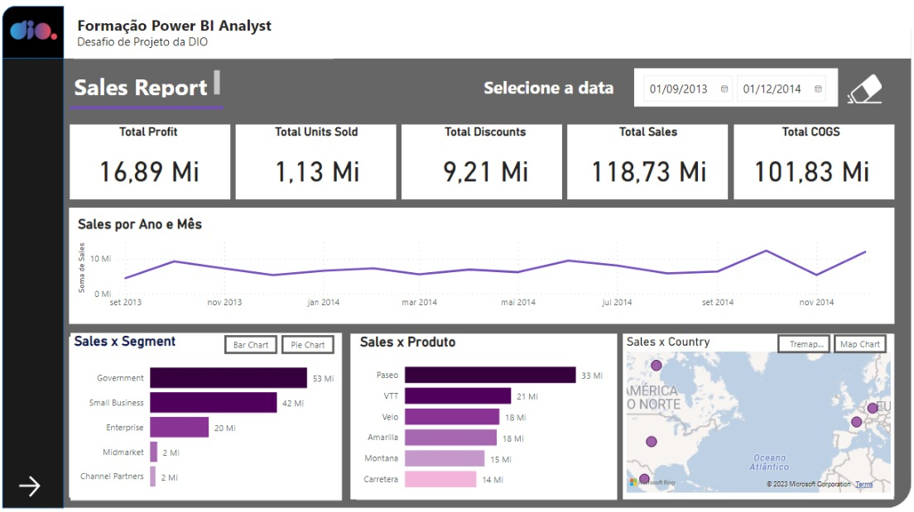
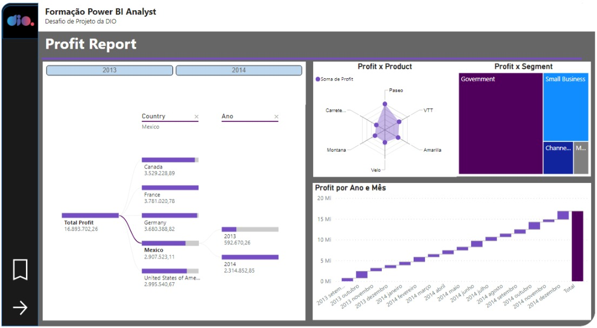
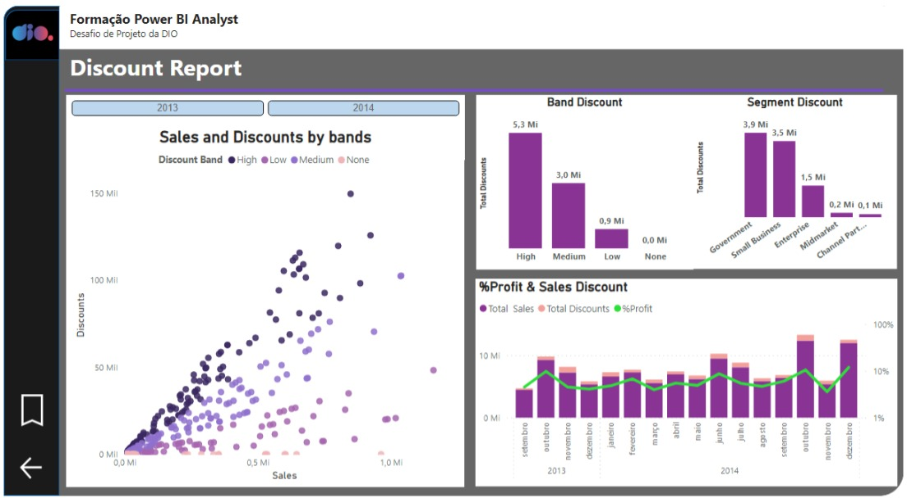

# Desafio: Criando Um Relatório Gerencial de Vendas com Power BI


## Documentação do Conjunto de Dados "financial sample.xlsx"

**Visão Geral**

O conjunto de dados "financial sample.xlsx" é um arquivo que contém informações financeiras relacionadas a vendas de produtos. Ele inclui várias colunas que descrevem aspectos importantes dos negócios, como segmentação de mercado, país, produtos, preços, vendas, custos e lucros.

### Colunas do Conjunto de Dados

Aqui estão as colunas do conjunto de dados e suas respectivas descrições:

1. **Segment (Segmento)**
   - Descrição: O segmento de mercado ao qual o produto pertence.
   
2. **Country (País)**
   - Descrição: O país onde a venda foi realizada.

3. **Product (Produto)**
   - Descrição: O nome do produto vendido.

4. **Discount Band (Banda de Desconto)**
   - Descrição: Corresponde a classificação do desconto, High(alto), Medium(médio), Low(baixo), None(sem desconto)

5. **Units Sold (Unidades Vendidas)**
   - Descrição: O número de unidades do produto vendidas.

6. **Manufacturing Price (Preço de Fabricação)**
   - Descrição: O custo de fabricação de uma unidade do produto.

7. **Sale Price (Preço de Venda)**
   - Descrição: O preço de venda de uma unidade do produto.

8. **Gross Sales (Vendas Brutas)**
   - Descrição: A receita bruta gerada pelas vendas (Unidades Vendidas * Preço de Venda).

9. **Discounts (Descontos)**
   - Descrição: O valor total de descontos aplicados às vendas.

10. **Sales (Vendas)**
    - Descrição: A receita líquida gerada pelas vendas (Vendas Brutas - Descontos).

11. **COGS (Custo dos Produtos Vendidos)**
    - Descrição: O custo dos produtos vendidos, é o custo total de fabricação ou compra de um produto que uma empresa vende. Inclui o custo dos materiais, mão de obra e outras despesas diretamente relacionadas à produção do produto.

12. **Profit (Lucro)**
    - Descrição: O lucro gerado pelas vendas (Vendas - Custo dos Bens Vendidos).

13. **Date (Data)**
    - Descrição: A data em que a venda foi realizada.
    
14. **Month Number (Mês em Número)**
    - Descrição: Mês em número em que a venda foi realizada.
    
15. **Month Name (Mês)**
    - Descrição: Mês em que a venda foi realizada.

16. **Year (Ano)**
    - Descrição: Ano em que a venda foi realizada.
    

### Sua gerente deseja ver um relatório sobre seus últimos números de vendas. Ela solicitou um resumo executivo para responder as seguintes perguntas:

1. **Qual é o desempenho de vendas por país?** 
   
2. **Como as vendas variam ao longo do tempo?**
    
3. **Qual segmento é o mais lucrativo?** 
    
4. **Qual produto gera o maior lucro?** 
   
5. **Como as vendas se comparam com os descontos oferecidos?** 
    
6. **Qual mês e ano tiveram mais lucro?** 
    
7. **Onde a empresa está tendo mais sucesso (por país)?** 
    
8. **Em qual produto e segmento a empresa deve continuar investindo?** 
    
10. **Incluir os seguintes indicadores:**
    * total lucro(profit).
    * total unidades vendidas(units sold)
    * total discontos(discounts)
    * total vendas(sales)
    * total custo dos produtos(cogs)
    

### O relatório foi desenvolvido no powerbi desktop e depois publicado é possível visualizar-lo pelo link abaixo:
[RELATÓRIO POWERBI](https://app.powerbi.com/view?r=eyJrIjoiODcyMzBmMGQtZGRiZi00ZDE3LTk4NjQtMWU2Njc0NzdlNGEwIiwidCI6Ijk4ZjkwMzVmLTZkOWMtNDBmMy1hNDI0LWI0NDY0M2NjMmYyZiJ9)_

### Print do relatório de Sales(Vendas):



### Print do relatório de Profit(Lucro):



### Print do relatório de Discount(Descontos):



### Respostas das perguntas após a conclusão dos relatórios:

1. **Qual é o desempenho de vendas por país?** 
    - Todos os países apresentam desempenho sólido, com receitas acima de 20 milhões, mas é importante destacar que os Estados Unidos lideram, com impressionantes 25 milhões em receitas.

2. **Como as vendas variam ao longo do tempo?**
    - Apesar de termos dados limitados, é evidente que os meses de junho, outubro e dezembro registram os maiores volumes de vendas, apontando para possíveis sazonalidades.

3. **Qual segmento é o mais lucrativo?** 
    - O segmento "Government" demonstra ser o mais lucrativo, contribuindo com um total de 11.388 milhões em lucro.

4. **Qual produto gera o maior lucro?** 
    - O produto "Paseo" destaca-se como o mais rentável, gerando um lucro acumulado de 4.797 milhões.

5. **Como as vendas se comparam com os descontos oferecidos?** 
    - Apesar da limitação nos dados históricos, observamos uma correlação entre o valor das vendas e os descontos oferecidos. Em geral, vendas mais altas tendem a estar associadas a descontos mais substanciais.

6. **Qual mês e ano tiveram mais lucro?** 
    - Dezembro de 2014 registrou o pico de lucratividade, gerando 2.025 milhões, representando cerca de 12% do lucro total acumulado.

7. **Onde a empresa está tendo mais sucesso (por país)?** 
    - Embora a Alemanha tenha liderado em lucratividade em 2013, a França alcançou o primeiro lugar em 2014, indicando variações nas regiões de sucesso.

8. **Em qual produto e segmento a empresa deve continuar investindo?** 
    - Em termos de produtos e segmentos de investimento, "Paseo" e o segmento "Government" demonstram demanda sólida. A estratégia de diversificação, especialmente entre os cinco principais, é recomendada para um crescimento contínuo.

### Conclusão:

**O relatório revela insights valiosos sobre o desempenho financeiro da empresa. Os Estados Unidos lideram as vendas, com destaque para dezembro de 2014 como o mês mais lucrativo. Além disso, o segmento "Government" e o produto "Paseo" mostram-se como líderes em lucratividade. Essas informações são cruciais para orientar as decisões estratégicas da empresa e identificar oportunidades de investimento. Acompanhar a sazonalidade e a relação entre vendas e descontos é essencial para um crescimento sustentável.**

**No mundo da análise  e visualização de dados, o Power BI se destaca como uma ferramenta essencial para criar relatórios interativos e painéis envolventes. No entanto, o Jupyter Notebook também é amplamente utilizado por cientistas de dados e analistas para explorar e analisar dados.**  
**Vamos explorar como utilizar o Power BI dentro do Jupyter Notebook**.

**Passo 1: Instalação da Biblioteca**

Antes de mergulhar de cabeça na integração, é necessário instalar a biblioteca Power BI para Python. Você pode fazer isso facilmente executando o seguinte comando no seu Jupyter Notebook:


```python
!pip install powerbiclient
```

**Passo 2: Carregando as Bibliotecas Necessárias**

Depois de instalar a biblioteca Power BI, importe as bibliotecas necessárias no seu notebook:


```python
from powerbiclient import QuickVisualize, get_dataset_config, Report
from powerbiclient.authentication import DeviceCodeLoginAuthentication
```

**Passo 3: Autenticação com a Conta do Power BI**

Para interagir com o Power BI, você precisa autenticar sua conta. Utilizaremos a autenticação com código de dispositivo, o que torna o processo seguro e conveniente:


```python
device_auth = DeviceCodeLoginAuthentication()
```

    Performing device flow authentication. Please follow the instructions below.
    To sign in, use a web browser to open the page https://microsoft.com/devicelogin and enter the code BK3UWVF8D to authenticate.
    
    Device flow authentication successfully completed.
    You are now logged in .
    
    The result should be passed only to trusted code in your notebook.


Siga as instruções para copiar o código gerado e cole-o após acessar o link fornecido. Isso autentica sua conta do Power BI.

**Nesse exemplo irei carregar o relatório recém criado e publicado.**

Para isso será necessário acessar o serviço do PowerBi Online já com o relatório devidamente publicado e copiar a ID do report e a ID do workspace onde salvou o report. Segue um exemplo abaixo:


```python
# report 
group_id="24041EF3-E463-4027-A5E6-85DFF3296BF9" # vá no pbi online em configurações/portal de administração/workspaces/detalhes 
report_id="c252dcb3-8f09-4285-9f09-096a6d814147" # abra o relatório clique em arquivo/inserir relatório/site ou portal/ copie o link e localize o reportID.
report = Report(group_id=group_id, report_id=report_id, auth=device_auth)
# Alterar a dimensão do report
report.set_size(600, 900)
```

**Passo 4: Exibindo o Relatório**


```python
#Exibindo o relatório
report

```


    Report(container_height=600.0, container_width=900.0)


### Com relatório interativo podemos realizar as análises diretamente aqui pelo jupyter e ainda utilizá-lo em uma apresentação ou até mesmo como uma documentação. 

