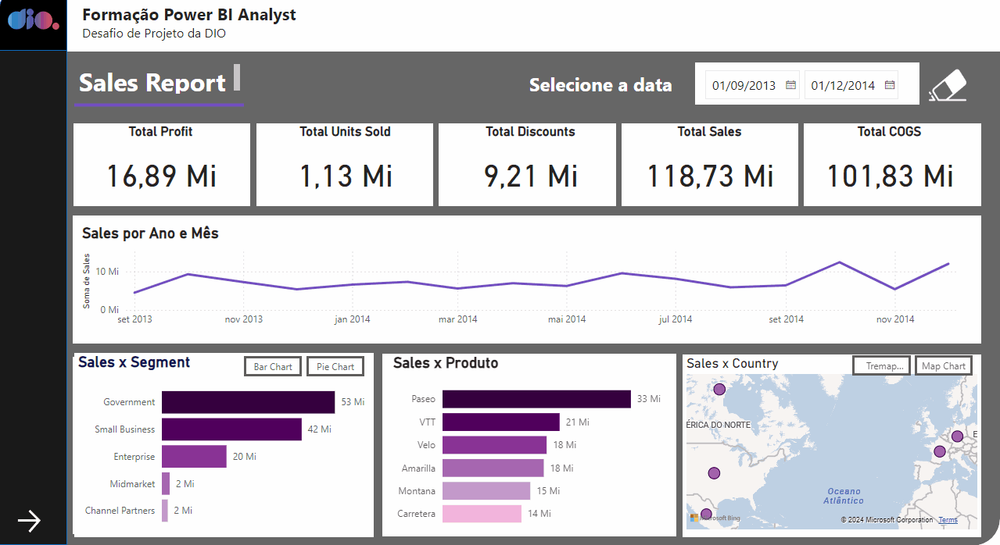
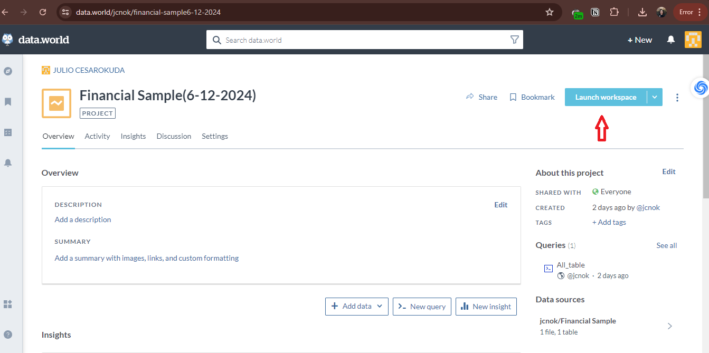
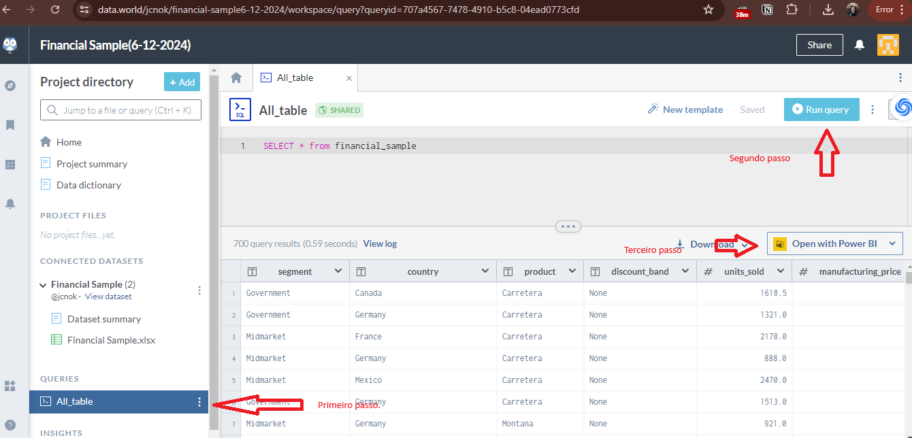
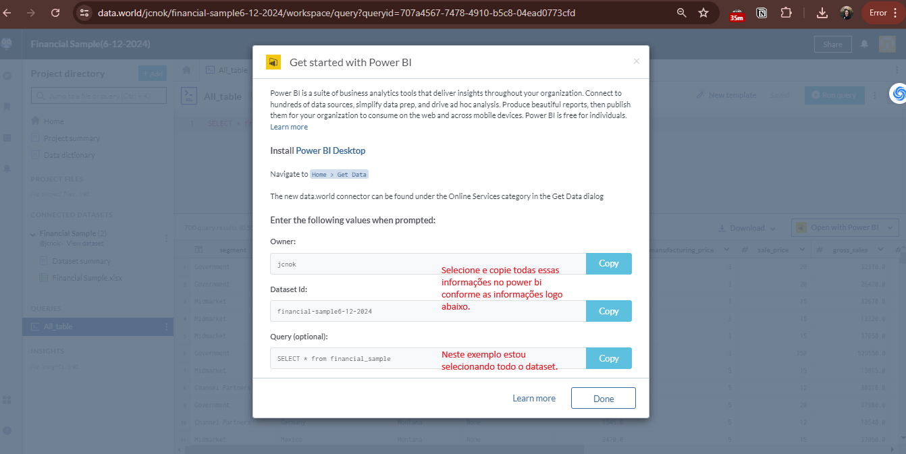
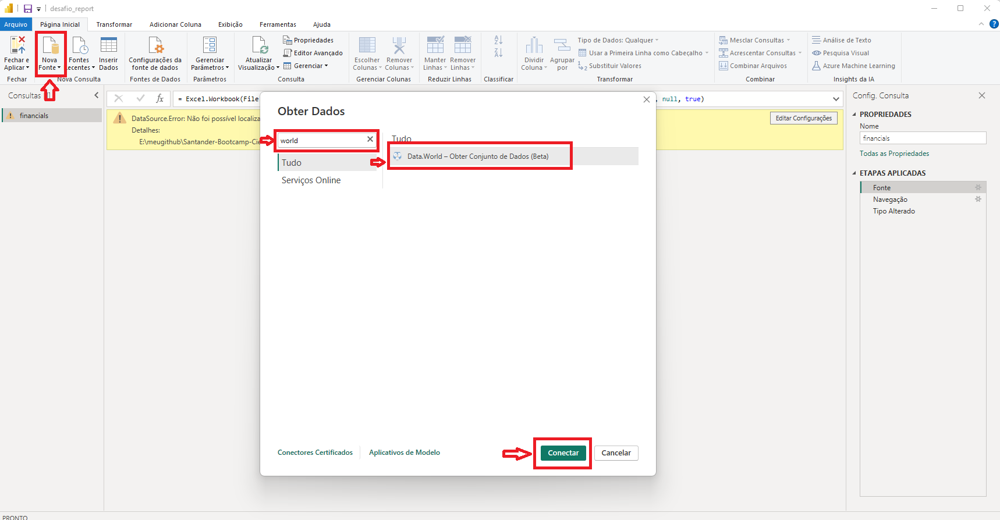
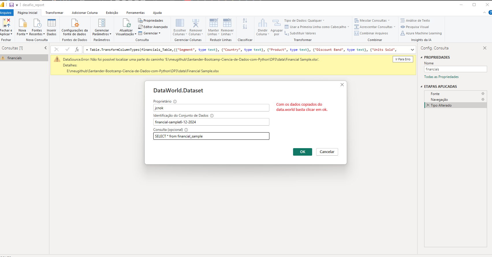
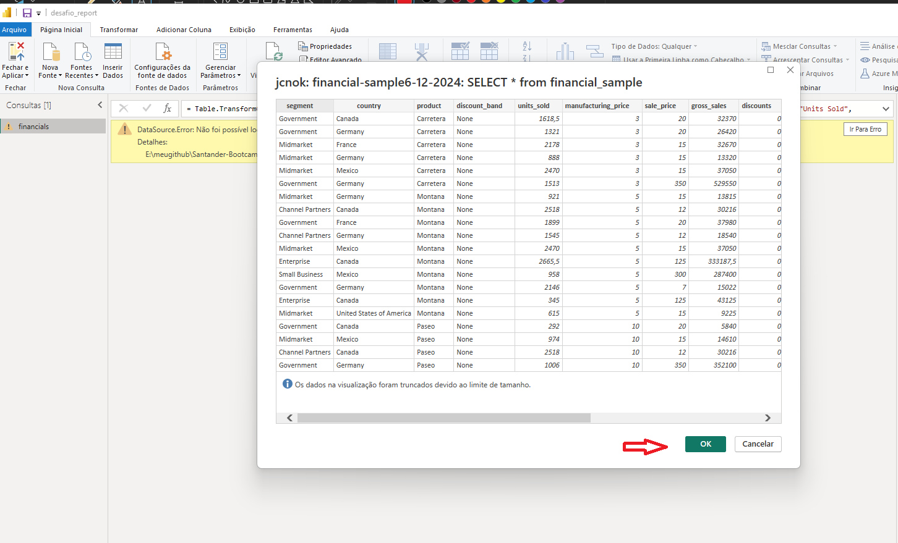
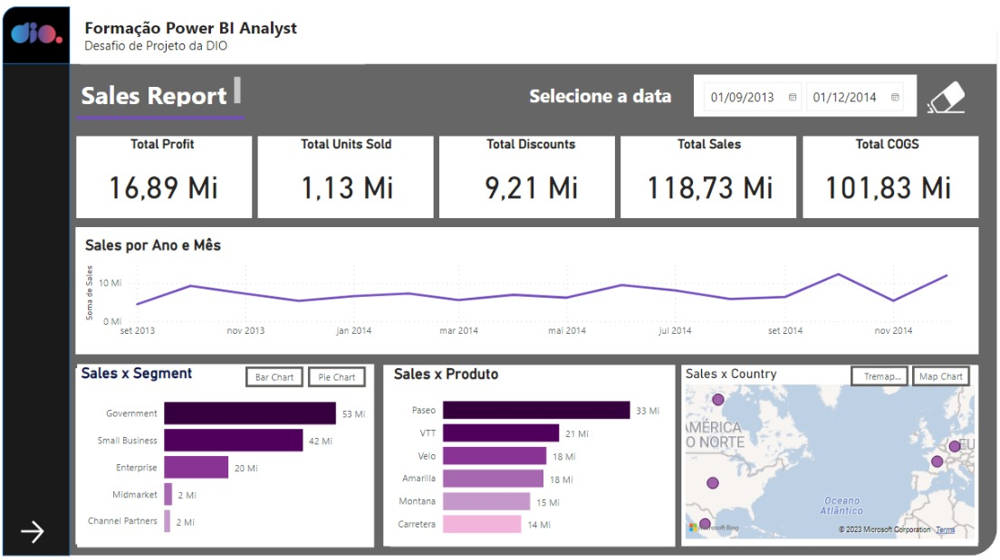
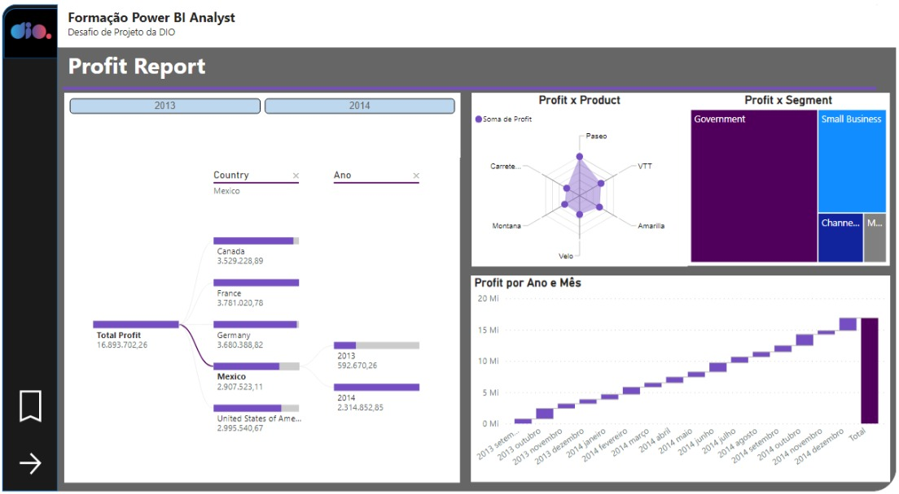
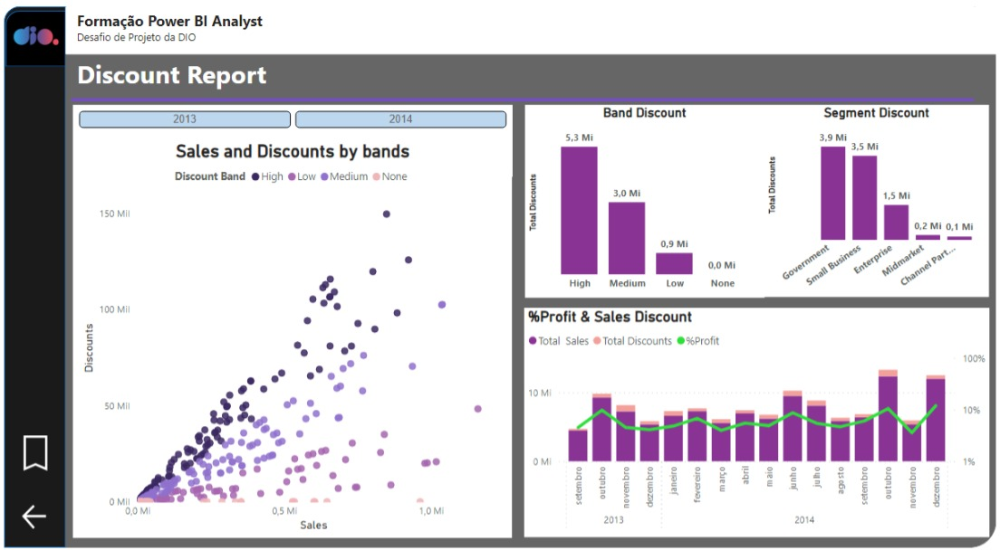

# Desafio:  Projeto de Integração de Dados com Power BI



## Visão Geral

Bem-vindo ao projeto de integração de dados com Power BI! Neste guia, você encontrará uma abordagem simplificada e eficiente para conectar e visualizar dados financeiros utilizando Power BI e a plataforma data.world. 

A escolha por data.world se deu pela sua facilidade de uso e replicação, eliminando a necessidade de criar uma conta na Azure para acessar o banco de dados MySQL. Este projeto demonstrará como carregar dados, realizar consultas SQL e integrar com Power BI de maneira otimizada, visando uma melhor compreensão e praticidade.

## Motivação

A decisão de utilizar [data.world](https://data.world/) foi impulsionada pela necessidade de uma solução prática e acessível para a replicação do projeto, sem comprometer a qualidade e a funcionalidade. Além disso, data.world oferece uma excelente plataforma para realizar consultas SQL diretamente nos dados carregados, permitindo uma integração suave com Power BI.

## Requisitos do Projeto

1. **Conta no [data.world](https://data.world/)**: Para seguir este tutorial, você precisará criar uma conta gratuita no data.world.

## Passo a Passo

### 1. Carregando Dados do data.world

1. Crie uma conta no [data.world](https://data.world/).
2. Após criar a conta, acesse o link do [banco de dados](https://data.world/jcnok/financial-sample6-12-2024) confome a imagem:


4. Nomeie o dataset de forma adequada, por exemplo, "Amostra Financeira".

### 2. Executando Consultas SQL no data.world

1. Navegue até o  dataset e clique em "New Query".
2. Utilize a interface SQL do data.world para escrever consultas. Por exemplo, para visualizar todas as entradas do arquivo:
   ```sql
   SELECT * FROM FinancialSample
   ```
3. Salve a consulta para utilizá-la posteriormente no Power BI.





### 3. Integrando com Power BI

1. Abra o Power BI Desktop.
2. Na tela inicial, selecione "Obter Dados" e escolha a opção "data.world".

5. Carregue os dados no Power BI.


### 4. Otimização e Visualização

Para otimizar a integração e visualização dos dados:

1. Ao invés de carregar todo o dataset, utilize consultas SQL para extrair apenas os atributos necessários.
2. Realize merges de tabelas diretamente nas consultas SQL no data.world para reduzir o volume de dados carregados no Power BI.
3. Utilize filtros e transformações no Power BI para criar visualizações significativas e interativas.

## Conclusão

Este projeto demonstra como é possível integrar e visualizar dados de maneira eficiente e prática utilizando Power BI e data.world. Ao optar por data.world, eliminamos a necessidade de configurar um banco de dados MySQL na Azure, simplificando o processo e facilitando a replicação.

A integração SQL com Power BI não apenas otimiza o desempenho, mas também oferece uma flexibilidade incrível na manipulação de dados. Esperamos que este guia tenha fornecido um caminho claro e eficaz para alcançar resultados semelhantes em seus projetos.


## Documentação do Conjunto de Dados "financial sample.xlsx"

**Visão Geral**

O conjunto de dados "financial sample.xlsx" é um arquivo que contém informações financeiras relacionadas a vendas de produtos. Ele inclui várias colunas que descrevem aspectos importantes dos negócios, como segmentação de mercado, país, produtos, preços, vendas, custos e lucros.

### Colunas do Conjunto de Dados

Aqui estão as colunas do conjunto de dados e suas respectivas descrições:

1. **Segment (Segmento)**
   - Descrição: O segmento de mercado ao qual o produto pertence.
   
2. **Country (País)**
   - Descrição: O país onde a venda foi realizada.

3. **Product (Produto)**
   - Descrição: O nome do produto vendido.

4. **Discount Band (Banda de Desconto)**
   - Descrição: Corresponde a classificação do desconto, High(alto), Medium(médio), Low(baixo), None(sem desconto)

5. **Units Sold (Unidades Vendidas)**
   - Descrição: O número de unidades do produto vendidas.

6. **Manufacturing Price (Preço de Fabricação)**
   - Descrição: O custo de fabricação de uma unidade do produto.

7. **Sale Price (Preço de Venda)**
   - Descrição: O preço de venda de uma unidade do produto.

8. **Gross Sales (Vendas Brutas)**
   - Descrição: A receita bruta gerada pelas vendas (Unidades Vendidas * Preço de Venda).

9. **Discounts (Descontos)**
   - Descrição: O valor total de descontos aplicados às vendas.

10. **Sales (Vendas)**
    - Descrição: A receita líquida gerada pelas vendas (Vendas Brutas - Descontos).

11. **COGS (Custo dos Produtos Vendidos)**
    - Descrição: O custo dos produtos vendidos, é o custo total de fabricação ou compra de um produto que uma empresa vende. Inclui o custo dos materiais, mão de obra e outras despesas diretamente relacionadas à produção do produto.

12. **Profit (Lucro)**
    - Descrição: O lucro gerado pelas vendas (Vendas - Custo dos Bens Vendidos).

13. **Date (Data)**
    - Descrição: A data em que a venda foi realizada.
    
14. **Month Number (Mês em Número)**
    - Descrição: Mês em número em que a venda foi realizada.
    
15. **Month Name (Mês)**
    - Descrição: Mês em que a venda foi realizada.

16. **Year (Ano)**
    - Descrição: Ano em que a venda foi realizada.
    

### Sua gerente deseja ver um relatório sobre seus últimos números de vendas. Ela solicitou um resumo executivo para responder as seguintes perguntas:

1. **Qual é o desempenho de vendas por país?** 
   
2. **Como as vendas variam ao longo do tempo?**
    
3. **Qual segmento é o mais lucrativo?** 
    
4. **Qual produto gera o maior lucro?** 
   
5. **Como as vendas se comparam com os descontos oferecidos?** 
    
6. **Qual mês e ano tiveram mais lucro?** 
    
7. **Onde a empresa está tendo mais sucesso (por país)?** 
    
8. **Em qual produto e segmento a empresa deve continuar investindo?** 
    
10. **Incluir os seguintes indicadores:**
    * total lucro(profit).
    * total unidades vendidas(units sold)
    * total discontos(discounts)
    * total vendas(sales)
    * total custo dos produtos(cogs)
    

### Print do relatório de Sales(Vendas):



### Print do relatório de Profit(Lucro):



### Print do relatório de Discount(Descontos):



### Respostas das perguntas após a conclusão dos relatórios:

1. **Qual é o desempenho de vendas por país?** 
    - Todos os países apresentam desempenho sólido, com receitas acima de 20 milhões, mas é importante destacar que os Estados Unidos lideram, com impressionantes 25 milhões em receitas.

2. **Como as vendas variam ao longo do tempo?**
    - Apesar de termos dados limitados, é evidente que os meses de junho, outubro e dezembro registram os maiores volumes de vendas, apontando para possíveis sazonalidades.

3. **Qual segmento é o mais lucrativo?** 
    - O segmento "Government" demonstra ser o mais lucrativo, contribuindo com um total de 11.388 milhões em lucro.

4. **Qual produto gera o maior lucro?** 
    - O produto "Paseo" destaca-se como o mais rentável, gerando um lucro acumulado de 4.797 milhões.

5. **Como as vendas se comparam com os descontos oferecidos?** 
    - Apesar da limitação nos dados históricos, observamos uma correlação entre o valor das vendas e os descontos oferecidos. Em geral, vendas mais altas tendem a estar associadas a descontos mais substanciais.

6. **Qual mês e ano tiveram mais lucro?** 
    - Dezembro de 2014 registrou o pico de lucratividade, gerando 2.025 milhões, representando cerca de 12% do lucro total acumulado.

7. **Onde a empresa está tendo mais sucesso (por país)?** 
    - Embora a Alemanha tenha liderado em lucratividade em 2013, a França alcançou o primeiro lugar em 2014, indicando variações nas regiões de sucesso.

8. **Em qual produto e segmento a empresa deve continuar investindo?** 
    - Em termos de produtos e segmentos de investimento, "Paseo" e o segmento "Government" demonstram demanda sólida. A estratégia de diversificação, especialmente entre os cinco principais, é recomendada para um crescimento contínuo.

### Conclusão:

**O relatório revela insights valiosos sobre o desempenho financeiro da empresa. Os Estados Unidos lideram as vendas, com destaque para dezembro de 2014 como o mês mais lucrativo. Além disso, o segmento "Government" e o produto "Paseo" mostram-se como líderes em lucratividade. Essas informações são cruciais para orientar as decisões estratégicas da empresa e identificar oportunidades de investimento. Acompanhar a sazonalidade e a relação entre vendas e descontos é essencial para um crescimento sustentável.**
